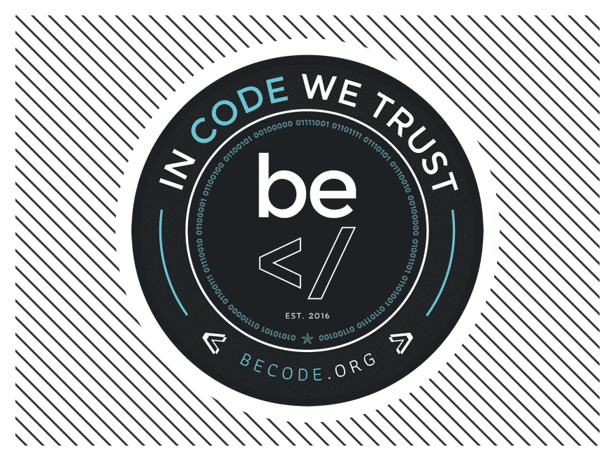

<!-- PROJECT LOGO -->
 

  

  <h1 align="center">Take advantage of regression</h1>
  <h3 align="center">Becode project to test our skills about regression</h3>

  

    by Saba Y., Didier U., Emre O. and Adam F.
     
    
  

<!-- TABLE OF CONTENTS -->
## Table of Contents

* [About the Project](#about-the-project)
  
* [Getting Started](#getting-started)
  * [Choosing the dataset](#choosing-the-dataset)
  * [Set Work Objectives](#set-work-objectives)
* [JSON File preprocessing](#JSON-File-preprocessing)
* [How did we handle the optionals ?](#How-did-we-handle-the-optionals-?)
* [What about the errors ?](#What-about-the-errors-?)
* [API](#API)
* [Outputs](#outputs)

<!-- ABOUT THE PROJECT -->
## About The Project

In our learning path at Becode we had multiple group projects focusing on real estate in Belgium. First we had to scrape some websites to find data and make a solid dataset. Then we had to "merge" all the other groups dataset and work on them. We have essentially done some major data cleaning and then used what we learned about data visualization to make a presentation. We had a week to get familiar with all types of regression, after which we were asked to test our knowledge to predict house prices on the Belgian market to the best of our abilities using the dataset of our previous mission. Now we have to deploy our model in an API using Flask, Docker and Heroku. 

<!-- GETTING STARTED -->
## Getting Started

Because of group changes, we had different models and dataset in order to complete the mission. Because of the required Json that we receive we had to rework our models in order to match the required features.

### Choosing the model

We've tried many different models to reach the best score possible. We've good results with the gradientBoosting one so we chose this one. 

### Setting work objectives

We had to split the tasks. So we can work paralelly to go further. We've scheduled regular meetings to be sure that everyone knows what the others are doing. 

<!-- USAGE EXAMPLES -->
## JSON File preprocessing

The Api accepts a posted JSON file. We have to work the data so it can fit the features to predict the price of the house. 
The JSON format is the folling:

{
    "data": {
            "area": int,
            "property-type": "APARTMENT" | "HOUSE" | "OTHERS",
            "rooms-number": int,
            "zip-code": int,
            "land-area": Optional[int],
            "garden": Optional[bool],
            "garden-area": Optional[int],
            "equipped-kitchen": Optional[bool],
            "full-address": Optional[str],
            "swimmingpool": Opional[bool],
            "furnished": Opional[bool],
            "open-fire": Optional[bool],
            "terrace": Optional[bool],
            "terrace-area": Optional[int],
            "facades-number": Optional[int],
            "building-state": Optional["NEW" | "GOOD" | "TO RENOVATE" | "JUST RENOVATED" | "TO REBUILD"]
    }
}

<!-- ROADMAP -->
## How did we handle the optionals ? 

<!-- CONTRIBUTING -->
## What about the errors ? 

<!-- LICENSE -->
## API

We have 2 routes:

* `/` that accepts a `GET` request which returns if the server is alive or not.
* `/predict` that accepts a `GET` request returning a string to explain what the `POST` expect (data and format) and a `POST`request that receives the data of a house in json format.

## Outputs

<!-- CONTACT -->
## How went our project?

